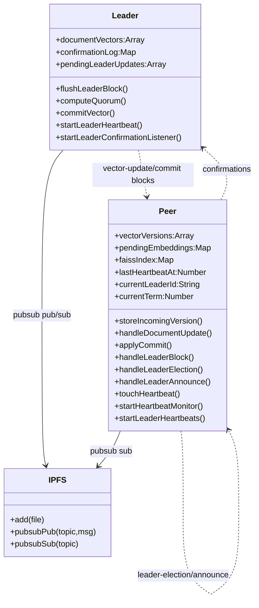
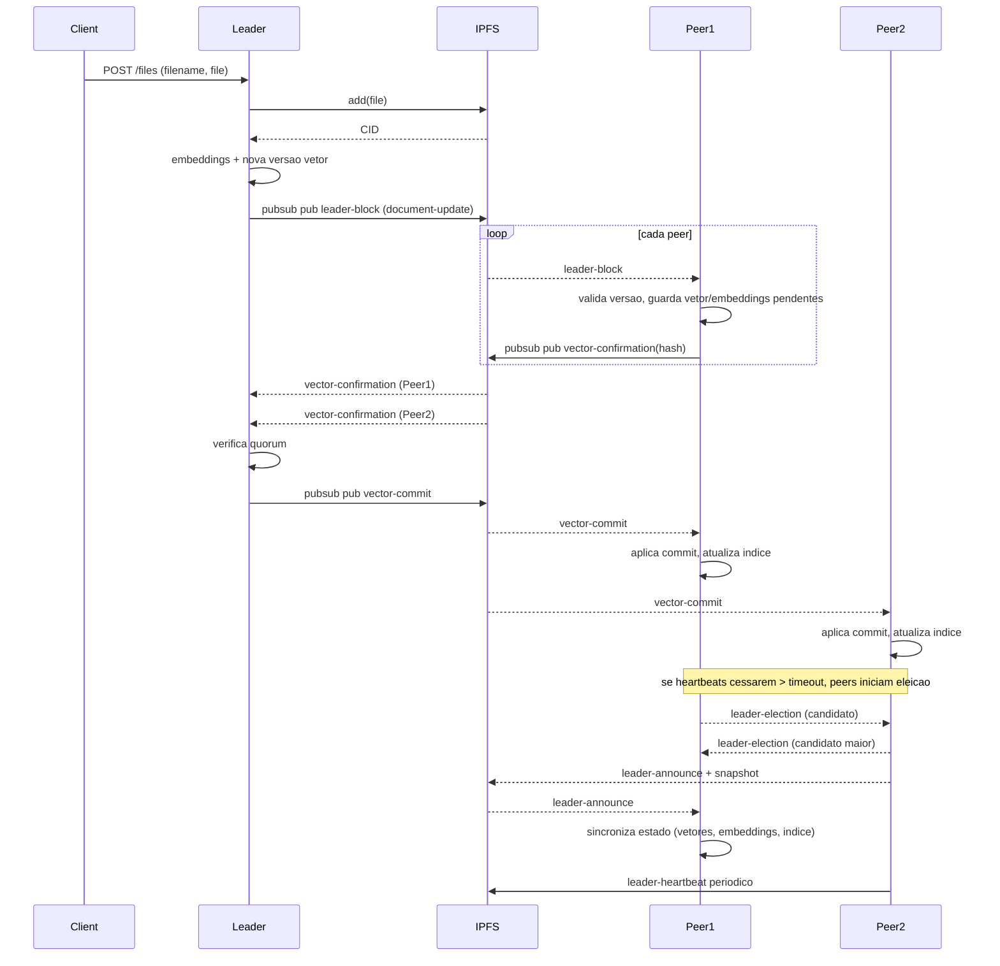

# Arquitetura do Sistema

- **Componentes**: Leader HTTP API, peers via pubsub, no IPFS (add/pin + pubsub), indice FAISS em memoria nos peers (simulado via Map), pipeline de embeddings.
- **Fluxo principal**: Cliente envia ficheiro -> Leader adiciona ao IPFS, gera embeddings e nova versao do vetor -> Enfileira `document-update` e envia em blocos/heartbeats -> Peers validam versao, guardam vetor/embeddings pendentes e enviam `vector-confirmation` com hash -> Leader recolhe confirmacoes, atinge quorum e envia `vector-commit` -> Peers aplicam commit e atualizam indice FAISS em memoria.
- **Fail-stop do leader**: Leader envia blocos/heartbeats periodicos (`LEADER_HEARTBEAT_INTERVAL_MS`, default 5s). Peers monitorizam `lastHeartbeatAt`; se exceder `PEER_HEARTBEAT_TIMEOUT_MS` (default 15s) sem heartbeat, assumem falha.
- **Quorum**: Confirmacoes com hash correto. Pode ser fixo (`PEER_QUORUM`) ou maioria dos peers observados/`PEER_COUNT_HINT`.

## Recuperacao e Eleicao de Lider (bully/RAFT simplificado)
- **Detecao de falha**: Se nao chegarem heartbeats/blocos alem de `PEER_HEARTBEAT_TIMEOUT_MS`, o peer dispara uma eleicao.
- **Eleicao**: Peers publicam `leader-election` com `candidateId` (peer de maior ID ganha). Apos espera (`VICTORY_DELAY_MS`), o maior candidato anuncia vitoria com `leader-announce` e snapshot do estado.
- **Novo lider**: O vencedor passa a enviar `leader-heartbeat` periodicos (`PEER_LEADER_HEARTBEAT_MS`). Outros peers sincronizam o estado a partir do snapshot (vetores, embeddings pendentes, indice em memoria).
- **Ambiente**: Ajuste `PEER_ELECTION_TIMEOUT_BASE_MS`, `PEER_ELECTION_TIMEOUT_JITTER_MS`, `PEER_VICTORY_DELAY_MS` conforme necessario para limitar tempo de recuperacao.

## Diagrama de Classes

## Diagrama de Sequencia

## Fluxo de Prompt (Fase 2)
- **Cliente -> Leader**: `POST /prompts` com `{prompt, mode?}` (`mode`: `faiss` ou `generate`). Leader gera `id` e `token`, armazena estado e publica `prompt-request` no pubsub.
- **Peers**: ao receber `prompt-request`, aguardam `PROMPT_CLAIM_JITTER_MS` aleatorio e publicam `prompt-claim`; o primeiro claim aceite recebe `prompt-claim-ack` do leader e processa.
- **Processamento**: Peer gera embedding da prompt (transformer offline com fallback), consulta o indice FAISS em memoria (Map) e retorna `prompt-response` com top-K matches (similaridade, CID, metadata). Em modo `generate`, o peer busca conteudos via IPFS (`cat`) para um trecho e monta resposta simples.
- **Entrega**: Leader escuta `prompt-response`, liga ao `id` e disponibiliza em `GET /prompts/:id`. Respostas são cacheadas para reenvio se houver pedidos repetidos.
- **Confiabilidade**: Leader rebroadcast de `prompt-request` a cada `PROMPT_REBROADCAST_MS` enquanto pendente; abandona/limpa por `PROMPT_RETENTION_MS`. Peers reapresentam claims se stale; heartbeats continuam independentes do fluxo de prompt.
