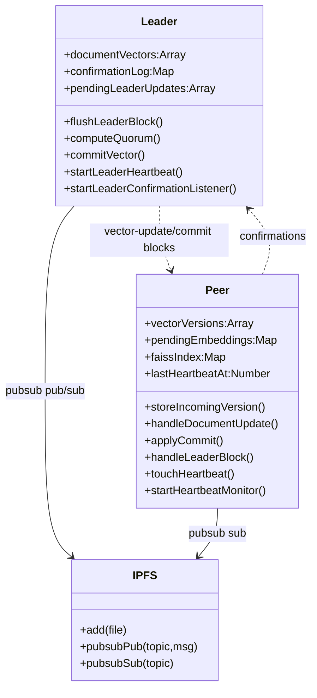
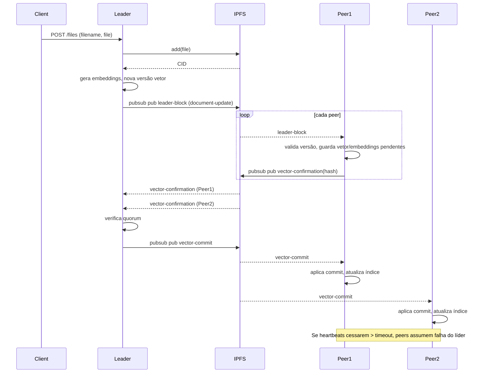

# Arquitetura do Sistema

- **Componentes**: Leader HTTP API, Peers subscritos via pubsub, nó IPFS (add/pin + pubsub), índice FAISS em memória nos peers (simulado via Map), pipeline de embeddings.
- **Fluxo principal**: Cliente envia ficheiro → Leader adiciona ao IPFS, gera embeddings e nova versão do vetor → Enfileira `document-update` e envia em blocos/heartbeats → Peers validam versão, guardam vetor/embeddings pendentes e enviam `vector-confirmation` com hash → Leader recolhe confirmações, atinge quorum e envia `vector-commit` → Peers aplicam commit e atualizam índice FAISS em memória.
- **Fail-stop do leader**: Leader envia blocos/heartbeats periódicos (`LEADER_HEARTBEAT_INTERVAL_MS`, default 5s). Peers monitorizam `lastHeartbeatAt`; se exceder `PEER_HEARTBEAT_TIMEOUT_MS` (default 15s) sem heartbeat, assumem falha.
- **Quorum**: Confirmações com hash correto. Pode ser fixo (`PEER_QUORUM`) ou maioria dos peers observados/`PEER_COUNT_HINT`.

## Diagrama de Classes

## Diagrama de Sequência

