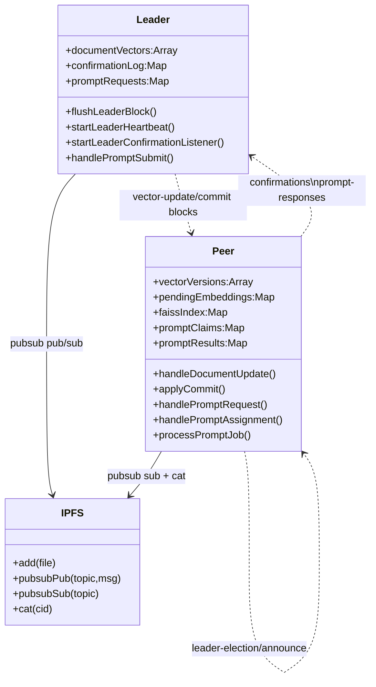

# Instruções para o Relatório

## Introdução
Aplicação distribuída para ingestão e recuperação de documentos via IPFS, com coordenação por um líder e processamento pelos peers. O líder expõe HTTP para upload de ficheiros e submissão de prompts, dissemina atualizações e recolhe confirmações/commits via pubsub. Os peers mantêm um índice FAISS em memória (simulado) e respondem a prompts distribuindo carga de forma oportunista.

## Arquitetura da solução em UML

## Implementação
- **API do Líder (`server.js`)**: endpoints `POST /files` (envio para IPFS, geração de embeddings e nova versão do vetor), `POST /prompts` e `GET /prompts/:id` (workflow de prompt com id/token). Publica blocos/heartbeats (`leader-block`) e recebe confirmações/commits; rebroadcast de prompts pendentes e limpeza por tempo. Mantém cache de respostas de prompt para pedidos repetidos.
- **Embeddings**: Usa `@xenova/transformers` (`feature-extraction`, modelo `all-MiniLM-L6-v2`) com fallback determinístico para estabilidade offline.
- **Peers (`peer.js`)**: subscrevem pubsub, validam versões, armazenam embeddings pendentes, aplicam commits e atualizam índice FAISS em memória. Participam em eleição simplificada (bully/RAFT-lite) para tolerância a falhas do líder.
- **Fluxo de Prompt distribuído**: Peers escutam `prompt-request`, fazem claim com jitter (`PROMPT_CLAIM_JITTER_MS`), líder confirma via `prompt-claim-ack`. Peer atribuído gera embedding da prompt, ranqueia top-K (`PROMPT_TOP_K`) por similaridade, opcionalmente busca trechos IPFS (`PROMPT_DOC_BYTES`) para montar resposta em modo `generate`, e publica `prompt-response`. Respostas e claims são cacheados e podem ser reenviados.
- **Configuração**: Variáveis de ambiente controlam tempos de heartbeat, eleição, rebroadcast e parâmetros de prompt. `PUBSUB_TOPIC` e `IPFS_BASE` devem ser comuns a líder e peers.

## Conclusão
**Limitações**: Índice FAISS é simulado em memória (perde-se em restart), sem persistência de embeddings; sem autenticação nos endpoints; ausência de verificação cripto nas mensagens pubsub; distribuição de carga oportunista (primeiro claim) pode ser enviesada por atrasos de rede.

**Melhorias Futuras**: Persistir índice/embeddings (FS ou base de dados); integrar FAISS real e shards por peer; adicionar assinatura/ACL para pubsub e API; observabilidade (métricas, tracing); política de reatribuição de prompts com prioridade e balanceamento; suportar modelos de geração locais mais robustos e streaming de respostas.

Daniel Pires pv25958

João Gomes pv25962 

Francisco Colaço pv25013
